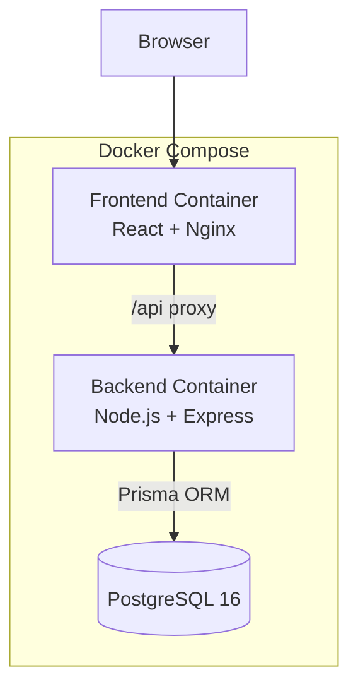
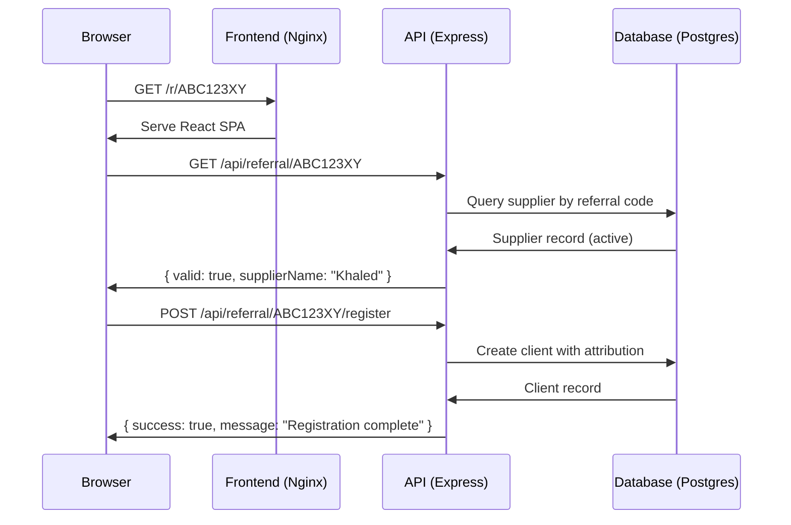

# Design Document: Partner Referral Portal

## Overview

The Partner Referral Portal is a web application that formalizes Aajil's supplier-to-client referral process. The system manages three user types (Admin, Supplier, Client), tracks referral attributions, and provides analytics on referral performance.

Given the 3-day assessment budget, the design prioritizes simplicity, correctness, and a smooth `docker-compose up` experience over scalability or production hardening.

### Key Design Decisions

| Decision | Choice | Rationale |
|----------|--------|-----------|
| Architecture | Monolith | 3-day budget; one repo, one deploy unit |
| Backend | Node.js + Express + TypeScript | Fast to ship, excellent ecosystem, type safety |
| Frontend | React + Vite + TypeScript | Fast dev loop, lightweight, widely understood |
| Database | PostgreSQL 16 | Relational model fits domain perfectly, robust in Docker |
| ORM | Prisma | Type-safe queries, auto-migrations, excellent DX |
| Auth | JWT (stateless) | Simple, no session store needed, fits scope guardrails |
| Validation | Zod | Shared schemas between frontend/backend, composable |
| Containerization | Docker Compose | Single-command startup as required |

### Scope Boundaries

- Email/SMS: `console.log` only — no real delivery
- Payments/KYC: Not in scope
- Auth: Simple JWT with env-configured secret (assessment context)
- Mobile: Desktop-first, basic responsiveness only
- i18n: English only
- Tests: Property-based tests on core business logic

## Architecture

### System Architecture



### Request Flow



### Container Architecture

Three containers orchestrated via Docker Compose:

1. **db** — PostgreSQL 16 Alpine with named volume for persistence
2. **backend** — Node.js Express server; runs Prisma migrations + conditional seed on startup
3. **frontend** — Nginx serving Vite-built React SPA; proxies `/api` to backend

Startup sequence:
1. `db` starts → healthcheck confirms PostgreSQL accepts connections
2. `backend` starts (depends on `db` healthy) → runs migrations + seed → starts Express
3. `frontend` starts (depends on `backend`) → serves static assets

### Directory Structure

```
/
├── docker-compose.yml
├── README.md
├── backend/
│   ├── Dockerfile
│   ├── package.json
│   ├── tsconfig.json
│   ├── vitest.config.ts
│   ├── prisma/
│   │   ├── schema.prisma
│   │   └── seed.ts
│   └── src/
│       ├── index.ts
│       ├── config.ts
│       ├── middleware/
│       │   ├── auth.ts
│       │   └── rbac.ts
│       ├── routes/
│       │   ├── auth.routes.ts
│       │   ├── admin.routes.ts
│       │   ├── supplier.routes.ts
│       │   └── referral.routes.ts
│       ├── services/
│       │   ├── auth.service.ts
│       │   ├── supplier.service.ts
│       │   ├── referral.service.ts
│       │   └── client.service.ts
│       ├── utils/
│       │   ├── referralCode.ts
│       │   └── validation.ts
│       └── tests/
│           ├── properties/
│           │   ├── referralCode.property.test.ts
│           │   ├── validation.property.test.ts
│           │   ├── attribution.property.test.ts
│           │   ├── deactivation.property.test.ts
│           │   └── isolation.property.test.ts
│           └── unit/
│               ├── auth.test.ts
│               └── supplier.service.test.ts
├── frontend/
│   ├── Dockerfile
│   ├── nginx.conf
│   ├── package.json
│   ├── vite.config.ts
│   └── src/
│       ├── main.tsx
│       ├── App.tsx
│       ├── api/
│       │   └── client.ts
│       ├── hooks/
│       │   └── useAuth.ts
│       ├── pages/
│       │   ├── Login.tsx
│       │   ├── AdminDashboard.tsx
│       │   ├── SupplierDashboard.tsx
│       │   └── ClientRegister.tsx
│       ├── components/
│       │   ├── ReferralLinkCard.tsx
│       │   ├── SupplierTable.tsx
│       │   ├── ClientList.tsx
│       │   ├── InviteForm.tsx
│       │   └── EmptyState.tsx
│       └── contexts/
│           └── AuthContext.tsx
└── .kiro/specs/
```

## Components and Interfaces

### Backend Services

#### AuthService

```typescript
interface AuthService {
  login(email: string, password: string): Promise<{ token: string; user: UserDTO }>;
  verifyToken(token: string): Promise<TokenPayload>;
}

interface TokenPayload {
  userId: string;
  role: 'admin' | 'supplier';
  email: string;
  exp: number;
}

interface UserDTO {
  id: string;
  email: string;
  name: string;
  role: 'admin' | 'supplier';
}
```

#### SupplierService

```typescript
interface SupplierService {
  create(input: CreateSupplierInput): Promise<SupplierDTO>;
  findAll(): Promise<SupplierWithStats[]>;
  findById(id: string): Promise<SupplierDTO | null>;
  deactivate(id: string): Promise<SupplierDTO>;
  reactivate(id: string): Promise<SupplierDTO>;
}

interface CreateSupplierInput {
  name: string;       // 1-100 chars, trimmed
  email: string;      // valid email format
}

interface SupplierWithStats {
  id: string;
  name: string;
  contactEmail: string;
  referralCode: string;
  status: 'active' | 'deactivated';
  referralCount: number;
  createdAt: Date;
}
```

#### ReferralService

```typescript
interface ReferralService {
  generateCode(): string;                // 8 alphanumeric chars
  buildLink(code: string): string;       // Full absolute URL
  validateCode(code: string): Promise<{ valid: boolean; supplierName?: string }>;
}
```

#### ClientService

```typescript
interface ClientService {
  register(input: RegisterClientInput, referralCode: string): Promise<ClientDTO>;
  findBySupplier(supplierId: string, page: number, pageSize: number): Promise<PaginatedResult<ClientDTO>>;
}

interface RegisterClientInput {
  businessName: string;   // required, non-empty
  contactName: string;    // required, non-empty
  phone: string;          // E.164 format
  email: string;          // valid email
}

interface PaginatedResult<T> {
  data: T[];
  total: number;
  page: number;
  pageSize: number;
  totalPages: number;
}
```

### API Routes

| Method | Path | Auth | Role | Description |
|--------|------|------|------|-------------|
| POST | `/api/auth/login` | None | — | Authenticate, return JWT |
| GET | `/api/auth/me` | JWT | Any | Return current user profile |
| POST | `/api/admin/suppliers` | JWT | Admin | Invite new supplier |
| GET | `/api/admin/suppliers` | JWT | Admin | List all suppliers with referral counts |
| GET | `/api/admin/suppliers/:id/clients` | JWT | Admin | List clients for a supplier |
| PATCH | `/api/admin/suppliers/:id/deactivate` | JWT | Admin | Deactivate supplier |
| PATCH | `/api/admin/suppliers/:id/reactivate` | JWT | Admin | Reactivate supplier |
| GET | `/api/supplier/me` | JWT | Supplier | Get own profile + referral link + stats |
| GET | `/api/supplier/me/clients` | JWT | Supplier | Get own referred clients (paginated) |
| GET | `/api/referral/:code` | None | — | Validate referral code, return supplier name |
| POST | `/api/referral/:code/register` | None | — | Register client via referral |

### Frontend Pages

| Route | Component | Access | Purpose |
|-------|-----------|--------|---------|
| `/login` | Login | Public | Email/password login |
| `/admin` | AdminDashboard | Admin | Supplier list, invite form, analytics |
| `/admin/suppliers/:id` | SupplierDetail | Admin | Drill-down into supplier's clients |
| `/dashboard` | SupplierDashboard | Supplier | Referral link, stats, client list |
| `/r/:code` | ClientRegister | Public | Client registration form |

### Key Frontend Components

- **ReferralLinkCard** — Displays referral URL in read-only field with copy button and status badge
- **SupplierTable** — Admin view of all suppliers with counts, status, deactivate/reactivate actions
- **ClientList** — Paginated list of referred clients with business name and date
- **InviteForm** — Name + email form with inline validation for inviting suppliers
- **EmptyState** — Reusable component for zero-data scenarios

## Data Models

### Entity Relationship Diagram

```mermaid
erDiagram
    User ||--o| Supplier : "has profile"
    Supplier ||--o{ Client : "refers"

    User {
        uuid id PK
        string email UK
        string passwordHash
        string name
        enum role "admin | supplier"
        timestamp createdAt
    }

    Supplier {
        uuid id PK
        uuid userId FK_UK
        string name
        string contactEmail UK
        string referralCode UK
        enum status "active | deactivated"
        timestamp createdAt
        timestamp updatedAt
    }

    Client {
        uuid id PK
        uuid supplierId FK
        string businessName
        string contactName
        string phone
        string email UK
        timestamp registeredAt
    }
```

### Prisma Schema

```prisma
generator client {
  provider = "prisma-client-js"
}

datasource db {
  provider = "postgresql"
  url      = env("DATABASE_URL")
}

enum Role {
  admin
  supplier
}

enum SupplierStatus {
  active
  deactivated
}

model User {
  id           String    @id @default(uuid())
  email        String    @unique
  passwordHash String
  name         String
  role         Role
  supplier     Supplier?
  createdAt    DateTime  @default(now())
}

model Supplier {
  id           String         @id @default(uuid())
  userId       String         @unique
  user         User           @relation(fields: [userId], references: [id])
  name         String
  contactEmail String         @unique
  referralCode String         @unique
  status       SupplierStatus @default(active)
  clients      Client[]
  createdAt    DateTime       @default(now())
  updatedAt    DateTime       @updatedAt
}

model Client {
  id           String   @id @default(uuid())
  supplierId   String
  supplier     Supplier @relation(fields: [supplierId], references: [id])
  businessName String
  contactName  String
  phone        String
  email        String   @unique
  registeredAt DateTime @default(now())
}
```

### Key Constraints

- `User.email` — unique, used for authentication
- `Supplier.contactEmail` — unique, prevents duplicate invitations (Req 1.4)
- `Supplier.referralCode` — unique, 8 alphanumeric characters (Req 1.2)
- `Client.email` — unique, prevents duplicate client registrations (Req 4.5)
- `Client.supplierId` — FK to Supplier, establishes attribution (Req 4.2)
- Deactivating a supplier does NOT cascade-delete clients (Req 7.3)

## Correctness Properties

*A property is a characteristic or behavior that should hold true across all valid executions of a system — essentially, a formal statement about what the system should do. Properties serve as the bridge between human-readable specifications and machine-verifiable correctness guarantees.*

### Property 1: Referral code format and uniqueness

*For any* generated referral code, it SHALL consist of exactly 8 characters where each character is alphanumeric (a-z, A-Z, 0-9), and *for any* set of N generated codes, all N codes SHALL be distinct.

**Validates: Requirements 1.2**

### Property 2: Referral link is a valid URL containing the code

*For any* valid 8-character alphanumeric referral code, the generated referral link SHALL be a valid absolute URL (parseable by the URL constructor) and SHALL contain the referral code extractable from the URL path or query parameters.

**Validates: Requirements 2.3**

### Property 3: Supplier creation yields active status

*For any* valid supplier name (1-100 non-whitespace-only characters) and valid contact email, creating a supplier SHALL produce a record with status "active" and a valid 8-character alphanumeric referral code.

**Validates: Requirements 1.1, 1.2**

### Property 4: Invalid supplier input is always rejected

*For any* supplier invitation input where the name is empty OR exceeds 100 characters OR the email does not match a valid email structure, the creation SHALL be rejected with an error identifying the invalid field, and no Supplier record SHALL be created.

**Validates: Requirements 1.5**

### Property 5: Client registration attributes to correct supplier

*For any* valid client registration data (non-empty business name, non-empty contact name, E.164 phone number, valid email) submitted through an active supplier's referral code, the resulting Client record SHALL have its supplierId set to that supplier's ID.

**Validates: Requirements 4.2**

### Property 6: Invalid client input is rejected

*For any* client registration input where any required field is empty OR the phone number does not match E.164 format OR the email does not match a valid email structure, the registration SHALL be rejected with a validation error identifying the invalid fields.

**Validates: Requirements 4.4, 4.6**

### Property 7: Referral count accuracy

*For any* supplier with N client records attributed to them in the database, the reported referral count SHALL equal exactly N — in both the supplier's own dashboard and the admin supplier list.

**Validates: Requirements 5.1, 6.1**

### Property 8: Client list sorting invariant

*For any* supplier with multiple attributed clients, the returned client list SHALL be sorted by registration date in descending order (most recent first), and each page SHALL contain at most 20 entries.

**Validates: Requirements 5.2, 6.3**

### Property 9: Supplier list sorted by referral count

*For any* set of suppliers in the admin dashboard view, the list SHALL be sorted by referral count in descending order (highest count first).

**Validates: Requirements 6.2**

### Property 10: Deactivated supplier rejects registrations

*For any* supplier with status "deactivated" and *for any* valid client registration data, attempting to register a client using that supplier's referral code SHALL be rejected.

**Validates: Requirements 7.2**

### Property 11: Deactivation preserves attributions

*For any* supplier with N attributed clients, after deactivation the supplier SHALL still have exactly N attributed client records with unchanged data.

**Validates: Requirements 7.3**

### Property 12: Deactivate/reactivate round-trip

*For any* active supplier, deactivating and then reactivating SHALL restore the supplier to "active" status with the same referral code, and subsequent client registrations using that code SHALL succeed.

**Validates: Requirements 7.1, 7.5**

### Property 13: Deactivation idempotence

*For any* supplier already in "deactivated" status, calling deactivate again SHALL produce an informational response and SHALL NOT change the supplier's state or attributed client records.

**Validates: Requirements 7.6**

### Property 14: Supplier data isolation

*For any* two distinct suppliers A and B, an authenticated request by supplier A to retrieve referral data SHALL never return client records attributed to supplier B.

**Validates: Requirements 8.3, 8.5**

## Error Handling

### Backend Error Envelope

All API errors follow a consistent JSON format:

```json
{
  "error": {
    "code": "VALIDATION_ERROR",
    "message": "Human-readable description",
    "fields": {
      "email": "Invalid email format"
    }
  }
}
```

The `fields` object is only present for validation errors with field-level detail.

### HTTP Status Codes

| HTTP Status | Error Code | When |
|-------------|-----------|------|
| 400 | `VALIDATION_ERROR` | Invalid input data (bad email, missing fields, name too long) |
| 401 | `UNAUTHORIZED` | Missing, malformed, or expired JWT |
| 403 | `FORBIDDEN` | Valid JWT but insufficient role for the resource |
| 404 | `NOT_FOUND` | Resource doesn't exist (including invalid/deactivated referral codes) |
| 409 | `CONFLICT` | Duplicate email, supplier already deactivated |
| 500 | `INTERNAL_ERROR` | Unexpected server errors |

### Validation Strategy

- **Backend**: Zod schemas validate all request bodies at the route handler level. Invalid requests are rejected before reaching service logic.
- **Frontend**: React Hook Form with Zod resolver provides instant client-side feedback. Backend remains source of truth.
- **Email format**: Simplified RFC 5322 regex
- **Phone format**: E.164 regex `/^\+[1-9]\d{1,14}$/`
- **Name length**: 1-100 characters after `.trim()`

### Error Scenarios by Requirement

| Scenario | HTTP | Error Code | Requirement |
|----------|------|-----------|-------------|
| Duplicate supplier email | 409 | CONFLICT | 1.4 |
| Invalid supplier name/email | 400 | VALIDATION_ERROR | 1.5 |
| Invalid/deactivated referral code | 404 | NOT_FOUND | 3.3, 4.3, 7.2 |
| Missing registration fields | 400 | VALIDATION_ERROR | 4.4 |
| Duplicate client email | 409 | CONFLICT | 4.5 |
| Invalid phone/email format | 400 | VALIDATION_ERROR | 4.6 |
| Already deactivated supplier | 409 | CONFLICT | 7.6 |
| Expired/invalid JWT | 401 | UNAUTHORIZED | 8.1, 8.7 |
| Insufficient role | 403 | FORBIDDEN | 8.6 |

### Frontend Error Handling

- API errors caught by Axios interceptor → transformed into toast notifications or inline field errors
- Network errors → generic "Connection failed" with retry
- 401 responses → clear stored token, redirect to `/login`
- 403 responses → redirect to user's role-appropriate dashboard
- Clipboard API failure → show fallback message, keep link visible for manual copy

## Testing Strategy

### Test Framework

| Layer | Tool | Rationale |
|-------|------|-----------|
| Unit + Property tests | Vitest + fast-check | Vitest is fast, ESM-native; fast-check is the standard PBT library for JS/TS |
| API integration | Supertest | In-process HTTP testing, no external server needed |

### Property-Based Tests (fast-check)

Each correctness property (see above) gets a dedicated property-based test file:

- **Library**: `fast-check` with Vitest
- **Iterations**: 100 per property (fast-check default)
- **Location**: `backend/src/tests/properties/`

Test files map to property groups:
- `referralCode.property.test.ts` — Properties 1, 2
- `validation.property.test.ts` — Properties 3, 4, 6
- `attribution.property.test.ts` — Properties 5, 7
- `deactivation.property.test.ts` — Properties 10, 11, 12, 13
- `isolation.property.test.ts` — Property 14

### Test Scope (3-Day Budget)

**Must have:**
- Property tests for referral code generation (Properties 1, 2)
- Property tests for input validation (Properties 4, 6)
- Property tests for attribution correctness (Property 5)
- Property tests for deactivation behavior (Properties 10, 11, 12, 13)
- Unit tests for auth middleware (JWT validation, role checks)

**Nice to have:**
- Property tests for sorting/pagination (Properties 8, 9)
- Property test for supplier data isolation (Property 14)
- Integration tests for full API flows

### Running Tests

```bash
# All tests
cd backend && npm test

# Property tests only
cd backend && npx vitest --run src/tests/properties/

# With coverage (stretch goal)
cd backend && npx vitest --run --coverage
```

### Docker Compose Configuration

```yaml
version: '3.8'
services:
  db:
    image: postgres:16-alpine
    environment:
      POSTGRES_DB: aajil_referral
      POSTGRES_USER: aajil
      POSTGRES_PASSWORD: aajil_dev
    ports:
      - "5432:5432"
    volumes:
      - pgdata:/var/lib/postgresql/data
    healthcheck:
      test: ["CMD-SHELL", "pg_isready -U aajil"]
      interval: 5s
      timeout: 3s
      retries: 5

  backend:
    build: ./backend
    environment:
      DATABASE_URL: postgresql://aajil:aajil_dev@db:5432/aajil_referral
      JWT_SECRET: dev-secret-change-in-prod
      PORT: 3000
      FRONTEND_URL: http://localhost:5173
    ports:
      - "3000:3000"
    depends_on:
      db:
        condition: service_healthy
    command: >
      sh -c "npx prisma migrate deploy && npx prisma db seed && node dist/index.js"

  frontend:
    build: ./frontend
    ports:
      - "5173:80"
    depends_on:
      - backend

volumes:
  pgdata:
```

### Seed Data Credentials

| Persona | Role | Email | Password |
|---------|------|-------|----------|
| Lina | Admin | lina@aajil.sa | admin123 |
| Khaled | Supplier | khaled@supplier.sa | supplier123 |
| Mona | Supplier | mona@supplier.sa | supplier123 |
| Yasser | Client | yasser@client.sa | — (no login) |

### Authentication Flow

- **Login**: POST `/api/auth/login` with email + password → returns JWT
- **Token storage**: `localStorage` (acceptable for assessment scope)
- **Token expiry**: 24 hours
- **Password hashing**: bcrypt, salt rounds = 10
- **JWT payload**: `{ userId, role, email, iat, exp }`
- **No refresh tokens**: Out of scope
