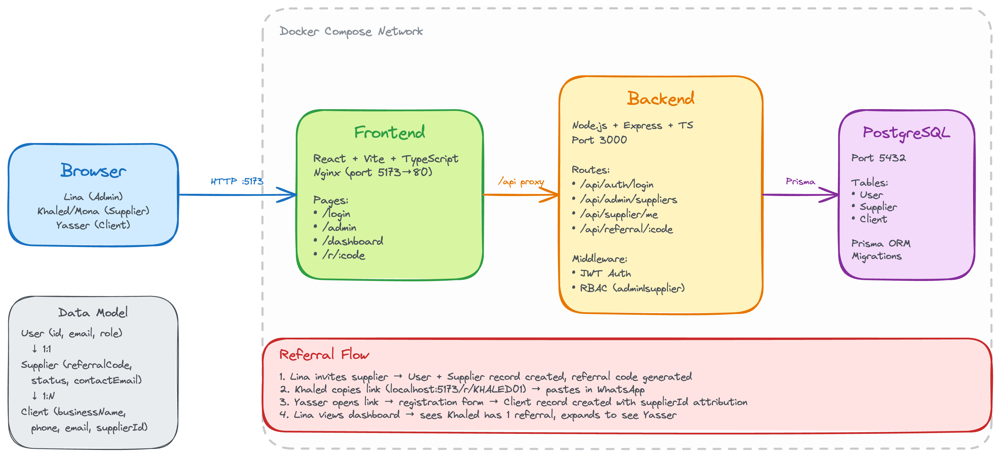
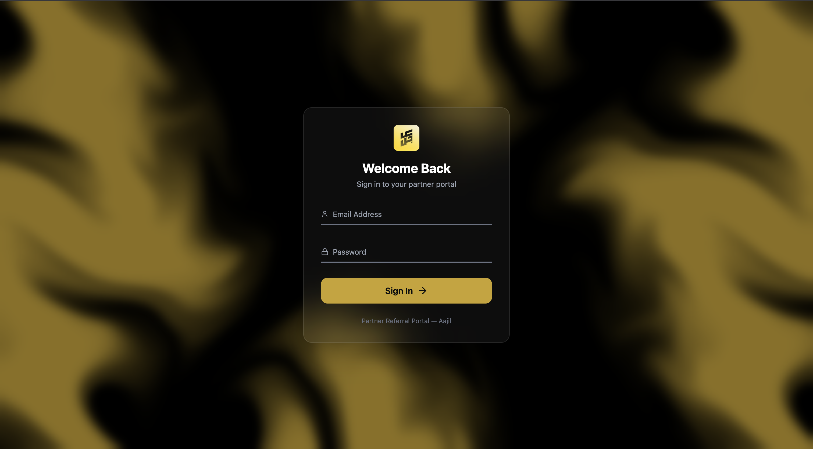
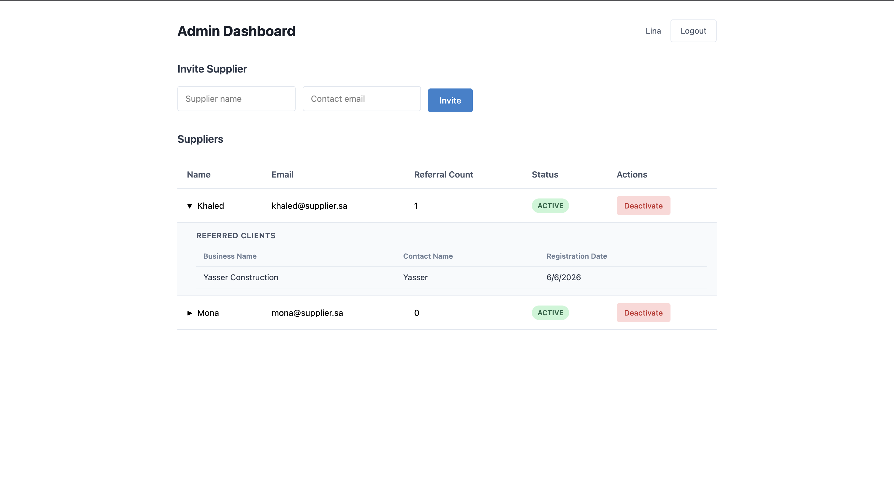

# Partner Referral Portal

A system that formalizes Aajil's supplier-to-client referral tracking. Suppliers get unique referral codes, clients register through referral links, and Growth Ops sees exactly who referred whom.

## Architecture



## Preview

| Login | Admin Dashboard |
|-------|----------------|
|  |  |

---

## Quick Start

```bash
docker compose up --build
```

That's it. Open **http://localhost:5173** -- ready in under 2 minutes on a fresh machine.

Requires Docker and Docker Compose installed. No other dependencies needed.

---

## Seed Credentials

| Persona | Role | Email | Password | Notes |
|---------|------|-------|----------|-------|
| Lina | Admin | `lina@aajil.sa` | `admin123` | Can invite suppliers, view analytics, deactivate |
| Khaled | Supplier | `khaled@supplier.sa` | `supplier123` | Has 1 referral (Yasser). Referral code: `KHALED01` |
| Mona | Supplier | `mona@supplier.sa` | `supplier123` | New supplier, 0 referrals. Code: `MONA0001` |
| Yasser | Client | `yasser@client.sa` | -- | Registered via Khaled's link. No login needed. |

**To test the full flow:**
1. Log in as Lina -- see dashboard with Khaled (1 referral) and Mona (0)
2. Log in as Khaled -- see referral link, copy it, see Yasser in client list
3. Open `http://localhost:5173/r/MONA0001` -- register a new client as Mona's referral
4. Log back in as Mona -- see the count go to 1

---

## What I Built

| Feature | Persona | What it does |
|---------|---------|--------------|
| Admin dashboard | Lina | Invite suppliers, see ranked referral counts, expand to view attributed clients, deactivate/reactivate |
| Supplier dashboard | Khaled/Mona | See referral link (one-click copy for WhatsApp), status badge, total count, paginated client list |
| Client registration | Yasser | Land on `/r/:code`, see referrer name, fill 4 fields, done. Invalid/deactivated codes show clear error |
| Auth and RBAC | All | JWT login, role-based route guards, proper 401/403 handling |
| Deactivation | Lina | Block new referrals but preserve all historical attribution data |

---

## What I Didn't Build (and Why)

| Skipped | Reason |
|---------|--------|
| Real email/SMS | Brief says stub it. Console log on invite is sufficient. |
| Payments/KYC | Explicitly out of scope. |
| OAuth/MFA | "Simple JWT is fine" per brief. |
| Mobile-responsive polish | Desktop-first. Registration page works on mobile (simple form) but not pixel-perfect. |
| i18n/Arabic | English only per brief. |
| 90% test coverage | Focused on property-based tests on business invariants (attribution, deactivation, isolation) -- 95 tests total. |

---

## What I'd Do With Another Week

1. Webhook/CRM integration -- POST to a CRM when a client registers so Lina doesn't check the portal manually
2. Referral link analytics -- track clicks vs. registrations (conversion funnel) per supplier
3. Supplier self-service password reset -- magic-link flow for when suppliers forget credentials
4. Bulk invite via CSV -- Lina onboards suppliers in batches; a CSV upload with validation saves time
5. WhatsApp deep-link preview -- og:meta tags so the referral link shows a rich preview card when pasted

---

## One Decision I'm Least Confident About

Auto-generated referral codes vs. supplier-chosen vanity codes. I went with fixed 8-char codes (`KHALED01`) for simplicity and collision avoidance. But Khaled might prefer a memorable code he can dictate verbally over the phone. If I had more signal on how suppliers actually share links (copy-paste vs. verbal), I'd revisit this.

---

## Stack

| Layer | Choice | Why |
|-------|--------|-----|
| Backend | Node.js, Express, TypeScript | Fast to ship, type-safe, excellent Prisma DX |
| Frontend | React, Vite, TypeScript, Tailwind | Fast dev loop, lightweight, good for internal tools |
| Database | PostgreSQL 16 | Relational model fits the domain (supplier to client attribution) |
| ORM | Prisma | Type-safe queries, auto-migrations, great DX |
| Auth | JWT (stateless) | Simple, no session store, fits assessment scope |
| Containers | Docker Compose | Single-command startup as required |
